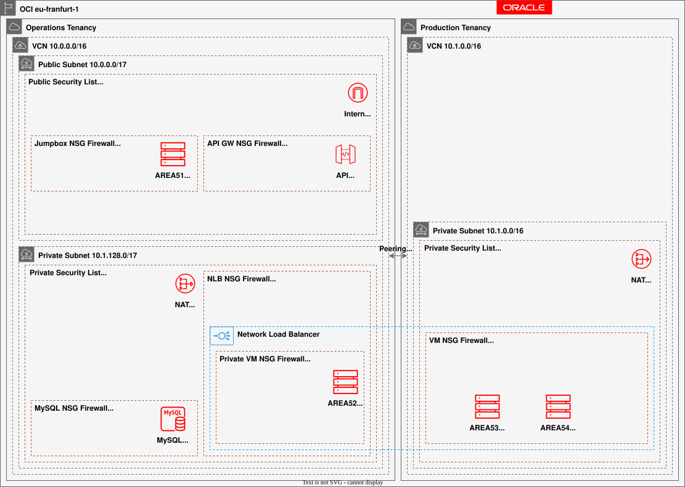

# Operations

## Oracle Cloud Infrastructure

## Operations Tenancy
- VCN: `OPS_VCN` `10.0.0.0/16`
- Public subnet `10.0.0.0/17`, private subnet `10.0.128.0/17`
- Internet gateway, NAT gateway, local peering to Production
- NSGs: `api_gw_nsg`, `jump_box_nsg`, `private_vm_nsg`, `nlb_nsg`, `db_nsg`, `faas_nsg`
- Instances: `AREA51` jump host in public subnet, `AREA52` private VM in private subnet
- Traffic: HTTPS internet → API GW; API GW → NLB HTTP; API GW → FaaS HTTPS; NLB → private VM HTTP; private VM → DB MySQL/3306/33060
- SSH: `AREA51` → private VM and Production VMs; Jump Box HTTPS from internet and API GW HTTP

## Production Tenancy
- VCN: `PROD_VCN` `10.1.0.0/16`
- Private subnet `10.1.128.0/17`
- NAT gateway, local peering to Operations
- Security list allows 8700 from `10.1.128.0/17`, all outbound egress
- NSG: `vm_nsg` for `AREA53` and `AREA54`
- Instances: `AREA53` `10.1.128.53`, `AREA54` `10.1.128.54`
- Traffic: SSH from `10.0.0.51/32`; MySQL/3306 and MySQL X/33060 egress to Operations DB; HTTPS egress to internet
